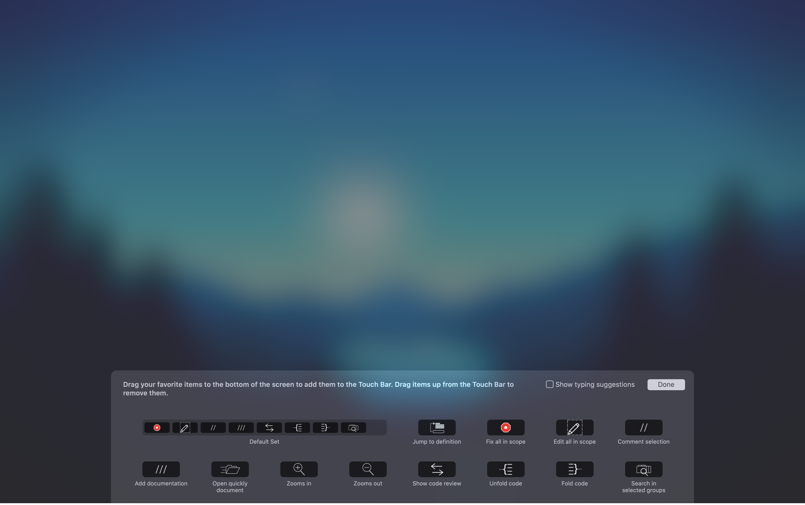

# XTouchBar

Making proper use of Touchbar inside Xcode.

# How to use this

**Disclaimer**: 
This tool uses the default shortcuts, if you customized some of your shortcuts, you can customize this easily to your desires.

**Before everything, if you are using any other keyboard than the one with American-US layout, add this keyboard as secondary inside you keyboard options**

Go to:
Settings -> Keyboard -> Input Sources -> click on plus and ADD  `American international - PC`.
After you added this keyboard you should be able to use this app.

The reason why this is needed is that I was only able to get the  `US keyboard layout (qwerty) GOLDEN STANDART KEY ADDRESSES`
(Look at `Key.swift`) from where I call the shortcut. Look down at `TL;DR` section if you wanna learn more.

### Now to the use...
Just run the application and... Let it work for you. For the first time you might need to enable something in accessibility to let this app press the keys.
I won't tell you to enable it, but I recommend you to do so :D But it's up to you now.
This application has build in system which observes which application is currently on foreground and according to it, 
it sets the touchbar application on foreground. So whenever you need
some shortcut which you don't remember, this touchbar tool is there for you :) Also if you don't like it and rather use the native 
debug touchbar screen, you can always dismiss it. Whenever you come back to the application, it will pop right back to be presented again.
If you don't find any of the given shortcut on the list, feel free to add it inside `Shortcut+Instances.swift`

## How to add shortcut
1. Uncomment it in `Shortcut+Instances.swift` (Don't worry, I dumped all the shortcuts with script, not manually :D )
2. When you uncomment it, put it below the active shortcuts which are at the top of the file
3. Optionally, you can add item 
4. After that add some `itemDescription` for `TouchBarCustomizationPallete` and assign it the right shortcut (Probably from Xcode Settings)
5. Add custom `NSTouchBarItem.Identifier` in `TouchBar+Identifiers.swift` (Follow for example add documentation)
6. Add the identifier together with the shortcut to `touchBarIdentifiers` and `itemsDictionary` inside `TouchBar+Identifiers`
7. You can now use this shortcut in the `TouchBarCustomizationPallete`!

## TS;WM
Basically keylogger which wil blow up your macbook, call shortcuts on fly and help you more with your workflow :) 

## Known limitations:
- Is useless for macs without touchbar 🤪
- There are missing icons for some touchbar items. Work in progress I guess ¯\_(ツ)_/¯
- A lot of shortcuts is missing. but **YOU** can help me with that. :) 
- No tests. This is very sad, but eventually I will get into that when this is fully working. (And I see you like it :) )

## Special thanks to
There goes my special thanks to [JK_Kross](https://twitter.com/JK_Kross) who at that time wasn't employed as iOS Dev but music teacher and did a great job by acompanying me in this project :) 

Guys at [MTMR](https://github.com/Toxblh/MTMR) from which I took inspiration, but not the code :)

[Megg](http://instagram.com/meggi_lindova) on Instagram for providing me some icons for some actions. :)   

This would be great honor to me because I never tought it is possible to make some return at least at money for the time I spend on
some tool.

## SUPPORT

If you want to support this project, feel free to send some coffee money to [this link](https://www.paypal.me/develodom) 

If you don't want to spend money, you can still support me if you will share this tool with your colleagues and tell them how nice it is and
how it improved your workflow. I personally love to use the documentation button :D:D

Oh yeah and, take a look at [guys at Showmax](https://tech.showmax.com), they are doing really cool stuff in a great way :) 

## TODO:
- [ ] Create some intuitive icon-set for the shortcuts.
- [ ] Add more sophisticated handling of setting the keyboard back to its default layout (Multithreading wtf??)
- [ ] Bonus, should go with previous point: Custom Xcode extensions. (Shouldn't be too hard since it's just dumb shortcut-caller)
- [ ] Restructurize the app so it's readable.
- [ ] Add tests for the components and run CI on this.
- [X] Figure out wtf is with `NSApplication.shared.toggleTouchBarCustomizationPalette(self.presenter)` so it is smoother UX. (Actually App needs to be active)
- [X] Add missing "virtual keys" (like arrow keys) to Key.swift
- [X] Finish the PropertyListParser (handle "<key>Text Key Bindings</key>" as well)
- [X] Transform Strings received from the parser into our Shortcut data model
- [X] Detect when Xcode is topmost application (focused), probably AppleScript is our friend :D
- [X] Create some mechanism that users can change to shortcuts on go.
- [X] Create collection for the buttons and assign to the buttons the given shortcuts.
- [X] Figure out how to call shortcuts to desired Xcode features
- [X] Add Swiftlint to format a style a bit :)

## TL;DR

### How this project works.
The first thing to do is to class-dump private Touchbar API from `AppKit` I really would love to know what `DFR` Prefix means, but let's put that aside :D
After we got this API, we can do pretty much what we want with the touchbar. We can replace the whole touchbar screen, or just the part we are supposed to, replace the
control buttons, add Nyan cat etc. You can read more inside `TouchBarPresenter`, `TouchBarPrivateAPI.h` and `AppDelegate`.

Okay, so now we have control of touchbar, what we need now is to create some of our view. At first I had some nice approaches in mind, the first one was to use da native approach
with multiple `NSTouchBarItems` and refresh the items every time there is some change in UI. Don't get me wrong, this approach is good. But I don't like it. I have seen MTMR
(Project that inspired me to do this) and I tought I want to do this the other way. Basically the function `presentSystemModal(touchBar:position:identifier)` is called there every single
milisecond because there is always something going on. I don't believe in this approach so I decided that we should probably use some view on it.
We decided to be hipsters af and create SwiftUI View on the touchbar which contains the buttons to call our desired actions. This is probably the simplest approach and the most
powerful one.

The main problem in this project is handling of shortcuts / quick actions / menu actions.
There came 3 ideas into my mind:

1. Hacking `IDEKit` and figuring out how to call actions via some private API.
- This seemed as cool idea, but after week of importing almost whole `IDEKit`  module I decided to gave up. If you look into my class-dump  -> https://github.com/DominikBucher12/IDEKit-Class-dump
You will find there very nice class `IDECommandManager` which should be responsible for caling the actions from random menus. As I acknowledged from Xcode stack trace (SIP off :/)
you need always to call `cacheCommandDefinitionsAndHandlers()` to buffer the commands into memory. Also I figured out I need to run Xcode AKA `IDEApplication` one more 
to store all the commands and get them from different stables.
However there is a lot of more steps to this to finally get `sendActionForCommandWithIdentifier(identifier:from:)` to work. I had a lot of fun with `IDEKeyBindingSet`
and other stuff which is related to the calling of commands. If you are bored, hacking Xcode is great entertainment for you, but don't expect quick results.
Note, if you don't know IDEKit, it's basically framework for Xcode and everything around it :) 
Also for this project you probably don't want to run Xcode twice just to run some app that runs small portion of it.

2. Applescript way AKA Legacy way
- I enjoy writing AppleScript a lot. I would find it most suitable, however I want to keep this clean and consistent and when Xcode changes some menu items, this could lead to
potentional problems. I haven't try this approach because I don't believe in it's sustainbility. I think the shortcuts is the golden way between Too hard and too easy implementation.
However I plan overwrite the shortcuts into the `IDEKit` way someday.

3. Call shortcut keys on the fly.
- This was the second approach we tried after me losing patience with hacking. The whole process is pretty simple, we have some enum `Key` which represents the keys on
the keyboard. Also there are some special keys like `cmd`,`shift`,`control`,`option`(called modifiers) which modify the key press. You can take a look at `Key.swift` for the list of
keys and their addresses. There is this nice object `KeyPresser` which virtually presses the keys. The keys are wrapped in `Shortcut` object which holds the keys which should be pressed
by `KeyPresser`.  Things get pretty interesting when user has his custom keybindings defined at `~/Library/Developer/Xcode/UserData/KeyBindings/`.
Then we need to parse the `idekeybinding` file and map the identifiers with different keys into our system and override the default ones. After we do that, we just call the overriden shortcut
instead of the default one.

PS. I Hate `IDEKit`.
